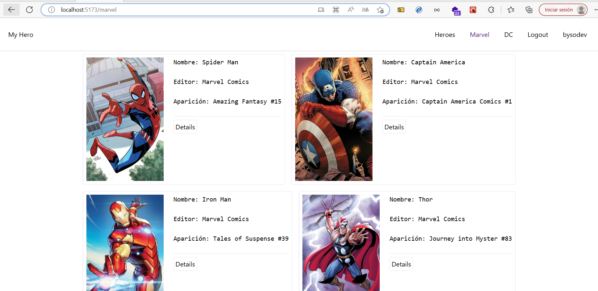
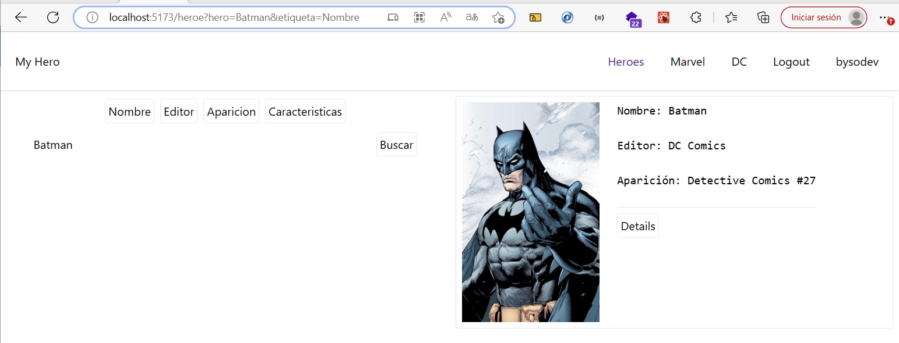
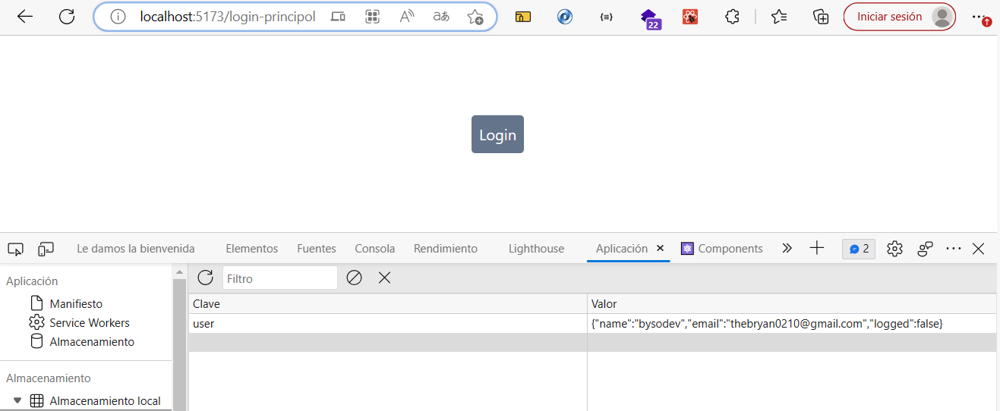

# Project Hero (Reducer, React Router v6)

Una vez clonado el proyecto se debe ejecutar los isguiente comandos:

Para instalar todas las dependecias existentes en el proyecto, las cuales estan alojadas en el archivo package-lock.json

**yarn install**: Para instalar todas las dependencias alojadas en el archivos package.json

**Descripción**: Es un proyecto basico que busca enlistar cartas con lso datos más relevantes de un superheroe, por medio de react router v6 se pudo hacer uns SPA para navegar entre superheroes de Marvel y DC, adicional una barra de busqueda para entrar un superheroe categorizandolos por medio de sus caracteristicas. 

**Aspectos**: Lo más importante puede ser el tema de las rutas con React Router v6, otra cuestión fue la implementación de Context y un Provider para establecer cierto acceso a la aplicación como tal. Dentro de quel provider de authentication se implementa un useReucer para tener centralizada las opciones de Login y Logout. Los estilos son de principiante porque es la primera practica con Tailwind. 

## En el caso de no poder hacer la descarga del proyecto a continuación se muestran las siguientes capturas:

- #### Se enlista todos los superheroes de marvel, la misma vista esta para los de DC

- #### Una busqueda de superheroes segun la categroia escogida (nombre, Editor, Aparacion, Caracteristicas)

- #### Vista del componenete dle login, para permitir el acceso al usuario donde por defecto son mis datos y la propeidad de logged como 'false'. 
